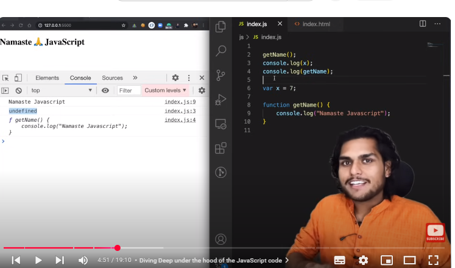
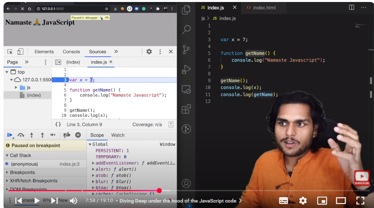
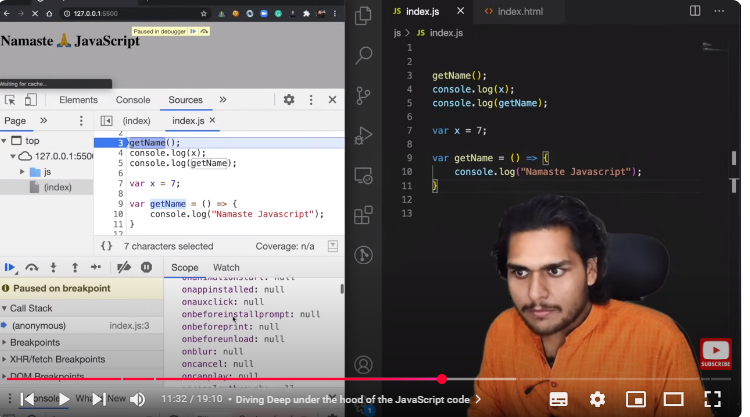
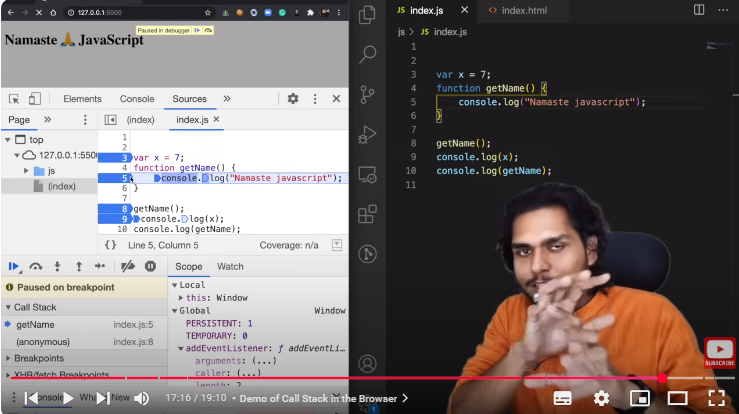

# JavaScript Hoisting and Execution Context

## Introduction
In this document, we will explore **Hoisting**, **Execution Context**, and **Call Stack** in JavaScript. These are fundamental concepts that explain how JavaScript code is processed and executed.

## What is Hoisting?
Hoisting is a JavaScript mechanism where **variables and function declarations** are moved to the top of their containing scope during the **compilation phase**, before the code execution begins.

### Key Points:
- **Variables declared with `var`** are hoisted but initialized with `undefined`.
- **Functions declared using `function`** are hoisted with their entire function body.
- **Variables declared using `let` and `const`** are hoisted but are in the **Temporal Dead Zone (TDZ)**, meaning they cannot be accessed before initialization.
- **Arrow functions** behave like variables; they are hoisted but assigned `undefined`.

---

## Execution Context
Every time JavaScript runs a script, an **Execution Context** is created. This consists of two phases:

### **1. Memory Creation Phase (Creation Phase)**
- Allocates memory for **variables** and **functions**.
- **Variables** are initialized with `undefined` (**except `let` and `const`**).
- **Function declarations** are stored entirely in memory.

### **2. Code Execution Phase**
- Executes the code **line by line**.
- Assigns values to **variables**.
- Invokes **functions**.

---

## Execution Context Flowchart

+------------------------------+
|   Global Execution Context   |
|------------------------------|
|  1. Memory Creation Phase    |
|  - Variables -> undefined    |
|  - Function -> Full Code     |
|------------------------------|
|  2. Code Execution Phase     |
|  - Variables get values      |
|  - Functions execute         |
+------------------------------+


# JavaScript Hoisting and Call Stack Examples

## Introduction

This document provides examples of JavaScript hoisting behavior with `var`, function declarations, arrow functions, and `let`/`const`. It also illustrates the Call Stack's operation with a practical example.

## Explanation

### Understanding Hoisting with Examples

**Example 1: Hoisting with `var`**

```javascript
console.log(x);  // Output: undefined
var x = 7;
console.log(x);  // Output: 7

```
**Explanation:**

*   The variable `x` is hoisted but initialized as `undefined`.
*   When accessed before initialization, it prints `undefined`.

**Example 2: Hoisting with Functions**

JavaScript

    getName(); // Output: "Hello"
    function getName() {
        console.log("Hello");
    }

**Explanation:**

*   Function declarations are fully hoisted.
*   `getName()` is accessible before its definition.

**Example 3: Hoisting with Arrow Functions**

JavaScript

    console.log(getName); // Output: undefined
    getName(); // TypeError: getName is not a function
    var getName = () => {
        console.log("Hello");
    };

**Explanation:**

*   The arrow function is treated like a variable.
*   `var getName` is hoisted but initialized as `undefined`, so calling it before initialization results in an error.

**Example 4: `let` and `const` in Hoisting**

JavaScript

    console.log(y); // ReferenceError: Cannot access 'y' before initialization
    let y = 10;
    console.log(y);

**Explanation:**

*   `let` and `const` variables exist in the Temporal Dead Zone (TDZ) until initialized.
*   Accessing them before initialization causes a `ReferenceError`.

### Call Stack in JavaScript

The Call Stack is a mechanism that keeps track of function calls in JavaScript.

**How Call Stack Works:**

*   When a function is called, it is added to the Call Stack.
*   When a function finishes execution, it is removed from the Call Stack.
*   The stack follows a Last-In, First-Out (LIFO) structure.

**Flowchart: Call Stack Execution**

Plaintext

    1. Global Execution Context (main script)
    2. Call Function `getName()`
       - Push `getName` to the Call Stack
    3. Execute `getName`
       - Remove `getName` from Call Stack
    4. Continue with the main script

**Example: Call Stack Execution**

JavaScript

    function getName() {
        console.log("Namaste");
    }
    console.log("Start");
    getName();
    console.log("End");

**Call Stack Execution Process:**

Plaintext

    1. Global Execution Context created
    2. "Start" is printed
    3. Function `getName` is called
       - Push `getName` to Call Stack
    4. "Namaste" is printed
       - Remove `getName` from Call Stack
    5. "End" is printed

## Summary

*   `var` variables are hoisted and initialized to `undefined`.
*   Function declarations are fully hoisted.
*   Arrow functions assigned to variables are hoisted like variables (initialized to `undefined`).
*   `let` and `const` are hoisted but remain in the Temporal Dead Zone (TDZ).
*   The Call Stack manages function execution order using LIFO.

## Conclusion

These examples illustrate the core concepts of hoisting and the Call Stack in JavaScript. Understanding these mechanisms is crucial for writing predictable and error-free code.






